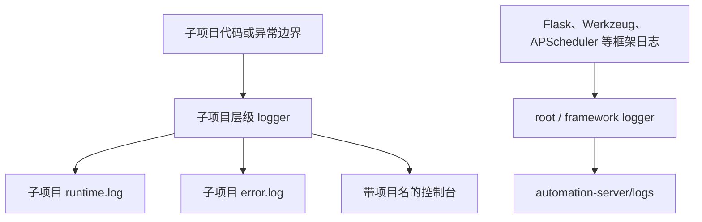
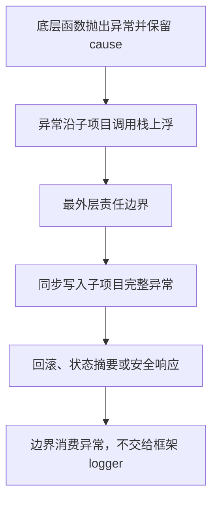

# Automation Flow 日志模块详细设计

> 状态：已审查，编码已执行
> 设计日期：2026-09-07  
> 前置文档：[日志模块调研与方案建议](./RESEARCH.md)  
> 选定方案：方案 A——Python 标准库 `logging`  
> 适用范围：`automation-server/` 主框架及全部 Python 子项目

## 1. 设计目标

本设计在不改变业务协议、数据库状态含义、任务文件规则和外部调用方式的前提下，引入统一日志基础设施，解决以下问题：

1. 控制台日志必须显示来源项目和模块，不再无法区分。
2. 日志持久化到主框架或各子项目自己的 `logs/` 目录。
3. ERROR/CRITICAL 额外写入同目录 `error.log`。
4. 子项目异常必须在离开子项目边界前记录完整 traceback，不能只保存 `str(error)` 或数据库中的截断摘要。
5. 子项目日志和异常不得写入主框架的 `runtime.log`、`error.log`。
6. 已捕获后返回、转换、重试或忽略的异常也不能静默丢失。
7. 子项目只做最小日志调用改造，共享配置与异常边界集中实现。
8. 日志可轮转、可长期运行，并遵守公开仓库与敏感信息规则。

## 2. 非目标

本阶段不包含：

- 不接入 Sentry、Loki、ELK、OpenTelemetry 或远程日志平台；
- 不引入 Loguru、structlog 或其他日志依赖；
- 不改数据库模型、Alembic 迁移、任务状态、API URL/字段/状态码；
- 不重构现有子项目为 Flask Blueprint；
- 不启动真实调度、访问真实数据库或处理真实业务文件；
- 不保证突然断电前尚未由操作系统刷盘的最后几个字节，但日志调用使用同步 file handler，不额外使用内存队列。

## 3. 强制设计决策

| 编号 | 决策 | 原因 |
| --- | --- | --- |
| D1 | 所有业务模块使用 `logging.getLogger(__name__)` | 模块名天然以子项目顶层包开头，可自动分流。 |
| D2 | 子项目顶层 logger 设置 `propagate=False` | 从传播链上阻止子项目记录进入 root。 |
| D3 | 主框架两个文件 handler 均增加 `FrameworkOnlyFilter` | 即使未来误开 propagation，框架文件仍拒绝子项目记录，形成第二道隔离。 |
| D4 | 子项目未处理异常必须在最外层边界记录并被边界消费 | 防止 Flask/APScheduler 用框架 logger 再次记录同一异常。 |
| D5 | 业务/服务层不“记录后再抛出” | 完整异常只在最终负责处理的边界记录一次，避免重复。 |
| D6 | traceback 使用显式异常三元组 | 即使记录动作被移动到清理或回滚之后，也不会丢失原异常堆栈。 |
| D7 | `runtime.log` 包含 ERROR，`error.log` 只包含 ERROR/CRITICAL | 同时保留完整业务时间线和快速错误入口。 |
| D8 | 文件写入同步执行，不使用 QueueHandler | 当前单进程日志量有限，优先保证异常落盘时序与实现简单。 |
| D9 | 日志目录在启动阶段立即创建并打开 | 无写权限时直接启动失败，不允许服务在没有持久日志的状态下继续运行。 |
| D10 | 完整 traceback 允许脱敏，但不得删减调用帧或异常链 | “完整”指全部调用帧、异常类型、cause/context 链完整；秘密和机器路径可替换为占位符。 |

## 4. 总体架构



子项目 logger 与 root logger 是两条独立落盘路径。子项目记录不会通过 root 中转，也不依赖对消息文本进行解析。

### 4.1 文件布局

```text
automation-server/
├─ logging_config.py
├─ logs/
│  ├─ runtime.log
│  ├─ runtime.log.1 ... runtime.log.10
│  ├─ error.log
│  └─ error.log.1 ... error.log.10
├─ image_compression/logs/{runtime.log,error.log,...}
├─ video_compression/logs/{runtime.log,error.log,...}
├─ iwara/logs/{runtime.log,error.log,...}
├─ jd_auto_match/logs/{runtime.log,error.log,...}
└─ vps_data_backup/logs/{runtime.log,error.log,...}
```

`logs/` 仅在运行时产生，不提交占位文件。`.gitignore` 同时显式覆盖：

```gitignore
automation-server/logs/
automation-server/**/logs/
```

## 5. `logging_config.py` 模块设计

### 5.1 公共接口

```python
def configure_logging() -> None:
    """在 Flask app 和任何子项目导入前，幂等配置日志。"""

def install_flask_exception_handler(app: Flask) -> None:
    """安装一次全局 HTTP 异常边界。"""

def install_uncaught_exception_hooks() -> None:
    """安装主线程与普通后台线程的最终兜底异常记录。"""

def project_from_logger_name(name: str) -> str | None:
    """从 logger 名称解析已登记子项目。"""

def project_from_traceback(tb: TracebackType | None) -> str | None:
    """从最内层 traceback 文件路径解析子项目。"""

def log_exception(
    logger: logging.Logger,
    message: str,
    error: BaseException,
    *args: object,
) -> None:
    """显式携带原始 traceback 记录异常。"""
```

子项目业务代码一般不调用配置函数，只使用标准 `logger`。`log_exception()` 只供集中异常边界或已离开原 `except` 上下文的辅助函数使用。

### 5.2 子项目登记表

使用显式、不可变的登记表，不自动扫描目录：

```python
PROJECT_NAMES = (
    "image_compression",
    "video_compression",
    "iwara",
    "jd_auto_match",
    "vps_data_backup",
)
```

匹配规则必须是 `name == project` 或 `name.startswith(project + ".")`，禁止只用 `startswith(project)`，避免类似 `iwara_tools` 被误归入 `iwara`。

### 5.3 初始化顺序

[`automation-server/app.py`](../../automation-server/app.py) 调整为以下逻辑顺序：

1. 导入 `configure_logging()`；
2. 调用 `configure_logging()`，创建并打开全部日志文件；
3. 调用 `install_uncaught_exception_hooks()`，使后续配置和导入失败也有兜底；
4. 导入/读取 `EnvConfig`，建立 Flask Config；
5. 创建 Flask app、SQLAlchemy 和 APScheduler；
6. 调用 `install_flask_exception_handler(app)`；
7. 由 [`automation-server/main.py`](../../automation-server/main.py) 继续导入子项目完成注册。

Flask 官方建议在创建 app 前配置日志，否则访问 `app.logger` 时可能自动增加默认 handler。设计必须保证 `configure_logging()` 早于 `Flask(__name__)`。

### 5.4 幂等性

幂等性同时使用：

- 模块级 `threading.Lock`；
- root logger 上的 `_autoflow_logging_configured` 标记；
- handler 上的 `_autoflow_managed` 和 `_autoflow_target` 标记。

第二次调用直接返回，不添加新 handler。测试需要重新配置时，只允许内部测试辅助函数关闭并移除 `_autoflow_managed` handler，不调用 `logging.shutdown()` 影响测试进程中的其他 logger。

### 5.5 Handler 配置

| Handler | 级别 | Filter | Formatter | 目标 |
| --- | --- | --- | --- | --- |
| 共享 console | INFO | `ContextFilter` | `console` | `sys.stderr` |
| framework runtime | INFO | `ContextFilter`、`FrameworkOnlyFilter` | `file` | `automation-server/logs/runtime.log` |
| framework error | ERROR | `ContextFilter`、`FrameworkOnlyFilter` | `file` | `automation-server/logs/error.log` |
| `<project>` runtime | INFO | `ContextFilter`、`ProjectOnlyFilter(project)` | `file` | `<project>/logs/runtime.log` |
| `<project>` error | ERROR | `ContextFilter`、`ProjectOnlyFilter(project)` | `file` | `<project>/logs/error.log` |

每个顶层子项目 logger 挂载共享 console、自己的 runtime 和 error handler，并设置：

```python
project_logger.setLevel(logging.INFO)
project_logger.propagate = False
```

root logger 只挂载共享 console、framework runtime 和 framework error。共享 console handler 可以被多个 logger 引用，但一次记录只会沿一条 logger 链处理，因此不会重复显示。

### 5.6 双重隔离规则

第一层是 logger 传播隔离：

```text
image_compression.* → image_compression logger → propagate=False
```

第二层是框架文件过滤：

```python
FrameworkOnlyFilter.filter(record) is True
iff project_from_logger_name(record.name) is None
and record.autoflow_project is empty
```

禁止通过匹配中文消息、文件名或 job 文本判断项目。只允许使用 logger 名称、显式 `autoflow_project` 字段和 traceback 路径。

### 5.7 文件 Handler 与轮转

使用 `logging.handlers.RotatingFileHandler`：

| 参数 | 值 |
| --- | --- |
| `maxBytes` | `10 * 1024 * 1024` |
| `backupCount` | `10` |
| `encoding` | `utf-8` |
| `errors` | `backslashreplace` |
| `delay` | `False` |

`delay=False` 让目录权限或文件打开错误在应用启动时立即暴露。创建目录或任一 handler 失败时：

1. 向 `sys.__stderr__` 输出一条不含配置值的启动错误；
2. 关闭本次已创建的 handler；
3. 重新抛出异常并终止启动；
4. 不降级为“只写控制台继续运行”。

运行期间 handler 写入失败时，自定义 `handleError()` 只向 `sys.__stderr__` 输出最小故障信息，不再调用 logging，避免递归。其他 handler 仍继续处理同一记录，因此 ERROR 正常情况下至少尝试写入 runtime、error 和控制台三处。

### 5.8 Formatter

文件格式：

```text
%(asctime)s.%(msecs)03d | %(levelname)-8s | %(project)s | pid=%(process)d %(threadName)s | %(name)s:%(lineno)d | %(message)s
```

控制台格式：

```text
%(asctime)s | %(levelname)-8s | %(project)s | %(name)s | %(message)s
```

时间格式为 `%Y-%m-%d %H:%M:%S`，使用运行机器本地时间。`ContextFilter` 为所有记录补充：

- `project`：已解析子项目名，否则为 `framework`；
- 缺失的 `mission_id`、`job_id`、`request_id` 使用 `-`，不能因 `extra` 缺失导致格式化失败。

异常格式使用标准库 traceback formatter，保留：

- 异常类型与消息；
- 全部调用帧和源码行号；
- `raise ... from ...` 形成的 `__cause__`；
- 隐式 `__context__`；
- ExceptionGroup 中的子异常。

禁止启用会自动输出局部变量值的增强 traceback。

## 6. 日志流向矩阵

| 记录来源 | 控制台 | 子项目 runtime | 子项目 error | 框架 runtime | 框架 error |
| --- | ---: | ---: | ---: | ---: | ---: |
| 子项目 INFO/WARNING | 是 | 是 | 否 | **否** | **否** |
| 子项目 ERROR/CRITICAL | 是 | 是 | 是 | **否** | **否** |
| 子项目完整异常 | 是 | 是 | 是 | **否** | **否** |
| Flask/Werkzeug/APScheduler 普通日志 | 是 | 否 | 否 | 是 | 按级别 |
| 框架自身异常 | 是 | 否 | 否 | 是 | 是 |
| 未识别第三方库日志 | 是 | 否 | 否 | 是 | 按级别 |

任何“子项目异常同时出现在框架 error”都视为验收失败，而不是允许的重复记录。

## 7. 异常捕获总体原则

### 7.1 一次记录原则



- 底层 service、模型、外部命令封装：只抛出带语义的异常，使用 `raise NewError(...) from error` 保留原因，不记录。
- 最外层责任边界：记录一次完整异常，然后执行回滚/状态更新/响应。
- 若恢复动作自身失败，它是新的独立异常，必须另记一条完整 ERROR，同时不能覆盖第一条原始异常。
- 只有进程必须终止的启动异常允许记录后继续向 Python 运行时抛出；它不进入框架 logger。

### 7.2 显式 traceback

集中辅助函数固定使用：

```python
logger.error(
    message,
    *args,
    exc_info=(type(error), error, error.__traceback__),
)
```

不能在辅助函数中仅使用 `logger.exception()` 并假设 `sys.exc_info()` 仍指向原异常。直接位于 `except` 中的简单调用可以使用 `logger.exception()`，但项目统一优先采用显式三元组，便于审查。

### 7.3 记录先于恢复

原始异常必须先完成一次日志调用，再执行可能再次失败的数据库回滚、临时文件清理或任务状态提交：

```python
except Exception as error:
    log_exception(logger, "任务失败 | mission_id=%s", error, mission_id)
    try:
        db.session.rollback()
    except Exception as rollback_error:
        log_exception(logger, "失败后的数据库回滚也失败", rollback_error)
    # 后续保存脱敏摘要，不覆盖原始错误日志
```

这样即使回滚或清理再次抛错，原异常也已经写入对应子项目。

## 8. Flask 请求异常边界

### 8.1 目标

子项目路由发生未处理异常时：

1. 自动识别该路由属于哪个子项目；
2. 完整异常只写入该子项目日志；
3. 返回与 Flask 默认语义一致的通用 500；
4. 不让 Flask 再使用 `app.logger` 记录同一异常；
5. 404、405 和显式 `abort()` 等 HTTPException 保持原行为，不作为程序异常记录。

Flask 官方允许注册 `Exception` handler，但明确要求先放行 `HTTPException`，避免吞掉正常 HTTP 状态。本设计遵循该规则。

### 8.2 项目解析

处理未捕获非 HTTP 异常时：

1. 读取 `request.endpoint`；
2. 从 `current_app.view_functions[endpoint]` 获取 view function；
3. 使用 `inspect.unwrap(view).__module__` 获取原模块；
4. 用 `project_from_logger_name()` 解析项目；
5. endpoint 不存在或不能解析时，再使用 traceback 最内层路径解析；
6. 两者都无法解析才归为框架异常。

### 8.3 响应行为

伪代码：

```python
def handle_application_exception(error):
    if isinstance(error, HTTPException):
        return error

    project = project_from_current_view() or project_from_traceback(error.__traceback__)
    target = logging.getLogger(f"{project}.http") if project else logging.getLogger("framework.http")
    log_exception(target, "HTTP 请求处理失败 | endpoint=%s", error, safe_endpoint)
    return InternalServerError()
```

不返回 `str(error)`，避免泄露内部信息；不改变现有成功响应。错误 handler 自身必须避免访问请求 body、headers 或 cookie。

## 9. APScheduler 任务异常边界

### 9.1 必要行为变化

当前图片和视频调度函数捕获异常后重新抛出。重新抛出后，APScheduler 会产生 job error，并可能用 `apscheduler.*` logger 写入框架错误文件。为满足“子项目异常不得写入框架错误文件”，新的最外层任务边界必须：

1. 把 `app.app_context()`、advisory lock 和 `process_one_mission()` 全部放入 `try`；
2. 捕获 `Exception`；
3. 先用子项目 logger 写完整异常；
4. 再尝试数据库回滚，回滚失败单独记录；
5. 返回 `None`，不再重新抛给 APScheduler。

因此 APScheduler 会把这次调用视为函数正常返回，不再生成同一异常的框架错误记录。下一调度周期仍会按现有 interval 继续运行。

### 9.2 已知取舍

- APScheduler 不再为这些已由子项目边界消费的异常发出 `EVENT_JOB_ERROR`，而是 `EVENT_JOB_EXECUTED`。
- 当前仓库没有 scheduler event listener 或依赖 `EVENT_JOB_ERROR` 的消费者，因此现阶段没有兼容性影响。
- 如果未来需要 job error event，应新增“项目感知的统一 listener + 框架 logger 抑制机制”，不能直接恢复裸 `raise`。

该取舍是本设计需要最终审查的重点，但在现有架构下，它是同时满足“完整捕获”和“不进入框架 error”最稳定、最少耦合的方式。

### 9.3 任务内部已处理异常

- `image_compression.process_mission()` 当前捕获后返回 `None`，必须在该 `except` 内先记录完整异常，再继续现有回滚、失败状态、2,000 字符摘要和返回行为。
- `video_compression.fail_mission()` 不能只接收字符串摘要；调用它的每个 `except` 必须先记录原始异常，或向它传递原始异常对象与 traceback。
- 临时文件清理中的 `except: pass` 必须改成带 traceback 的 ERROR；如果该失败属于已明确可恢复的情况，可用 WARNING，但仍需 `exc_info`。鉴于 error 文件只接收 ERROR，所有可能影响任务一致性、状态或残留文件的清理异常统一按 ERROR。
- 外部命令异常只在最终任务边界记录一次；FFmpeg/FFprobe/7-Zip 输出继续使用现有长度限制。

## 10. 启动、导入与后台线程兜底

### 10.1 `sys.excepthook`

日志配置成功后安装主线程 hook：

- `KeyboardInterrupt` 调用原始 hook，不记录为业务错误；
- 其他未捕获异常通过最内层 traceback 路径解析项目；
- 能解析项目时写对应子项目 CRITICAL；否则写框架 CRITICAL；
- 记录后不再次调用原始 hook，控制台输出由已配置 console handler 完成，避免重复；
- hook 记录失败时使用保存的原始 hook 作为最后兜底。

这可捕获 `main.py` 导入子项目期间的注册异常，而不需要改变现有 `__init__.py` 注册链。

### 10.2 `threading.excepthook`

安装普通线程未捕获异常 hook，处理方式与 `sys.excepthook` 相同。`SystemExit` 不作为错误记录。保存原始 hook，并在自定义 hook 自身失败时回退。

### 10.3 边界覆盖限制

- Flask 请求异常由 Flask handler 捕获，不会到达 `threading.excepthook`；
- APScheduler 会在 executor 内捕获 job 异常，因此必须由第 9 节任务边界先处理；
- 子进程内部异常不会自动回传 Python traceback，父进程只能根据退出码和 stderr 抛出业务异常，再由子项目边界记录；
- 当前项目没有 asyncio 入口，因此本阶段不安装 event loop exception handler。

## 11. 子项目日志调用规范

### 11.1 级别

| 级别 | 使用场景 |
| --- | --- |
| DEBUG | 仅开发诊断；不记录完整输入、凭据或大文本。默认不落盘。 |
| INFO | 任务发现、领取、提交、完成等正常生命周期事件。 |
| WARNING | 可预期、已安全处理且不影响一致性的业务拒绝或可恢复条件。 |
| ERROR | 操作失败、任务失败、回滚/清理失败、未处理请求异常；有 Python 异常时必须带 traceback。 |
| CRITICAL | 子项目注册失败、日志基础设施不可用、进程无法继续。 |

### 11.2 消息字段

日志使用稳定的 `key=value` 上下文，优先包含：

- `mission_id`：存在任务实体时必须有；
- `job_id`：scheduler 边界必须有；
- `endpoint`：HTTP 异常必须有；
- `status`：状态转换相关日志必须有；
- `file` 或 `source`：只允许安全 basename，不默认记录完整绝对路径；
- `duration_ms`：有明确开始时间时记录。

示例：

```python
logger.info(
    "任务处理完成 | mission_id=%s | status=%s | file=%s",
    mission.id,
    mission.status,
    mission.file_name,
)
```

禁止使用 `print()`、`traceback.print_exc()` 或直接向文件 `open(...).write(...)` 绕过统一配置。

### 11.3 禁止静默捕获

编码阶段对 `automation-server/**/*.py` 做静态搜索，逐项审查：

- `except: pass`；
- `except Exception: return`；
- 只保存 `str(error)` 后返回；
- 只 `raise` 但最终由框架 logger 接收；
- `logger.error(str(error))` 但没有 `exc_info`。

允许不记录的情况必须同时满足：异常是明确预期的控制流、不会影响数据一致性、代码注释说明原因，并且测试覆盖；否则必须记录或继续抛到已知子项目边界。

## 12. 敏感信息与脱敏

### 12.1 禁止记录内容

- 密码、token、API key、cookie、Authorization 和完整 headers；
- 数据库连接串、带查询参数的完整 URL；
- 简历全文、职位请求完整 body、浏览器日志完整原始对象；
- 源/输出目录的真实绝对路径；
- 无长度限制的 FFmpeg、FFprobe、7-Zip 或 HTTP 响应正文。

### 12.2 traceback 脱敏

文件 formatter 在最终文本上执行脱敏，不改变 traceback 的帧数和异常链：

- 已知配置目录替换为 `<configured-directory>`；
- URL userinfo、Bearer token 和常见秘密键值替换为 `<redacted>`；
- 控制字符转义，异常 traceback 自身的换行结构保留；
- 不显示局部变量字典。

如果无法安全判断某个值，按敏感信息处理。脱敏逻辑不得把原始日志内容另写到调试文件。

### 12.3 浏览器上报日志

`iwara/apis/log.py` 保留现有 URL 与响应协议，但增加：

- JSON 必须是对象；
- `log` 只允许 `debug/info/warning/error/critical`，大小写归一；
- `info` 必须是字符串并设置最大长度；
- CR/LF 和控制字符转义为单行；
- 不接受或记录 headers、cookie 等额外字段；
- 客户端报告 ERROR 仅表示客户端错误消息，没有 Python traceback，不伪造 traceback。

## 13. 具体文件改动计划

### 13.1 新增

| 文件 | 职责 |
| --- | --- |
| `automation-server/logging_config.py` | 项目登记、handler、filter、formatter、初始化、Flask handler、未捕获异常 hooks。 |
| `automation-server/tests/test_logging_config.py` | 分流、隔离、堆栈、轮转、幂等、写入故障与 hooks 的离线测试。 |
| `automation-server/tests/test_exception_boundaries.py` | Flask 与 scheduler 边界行为测试。 |

若实现时发现根测试目录会破坏现有测试发现，可将测试放在 `automation-server/logging_tests/`；不应为了日志模块移动现有子项目测试。

### 13.2 修改

| 文件/范围 | 设计改动 |
| --- | --- |
| `automation-server/app.py` | 最早初始化日志，安装 Flask 异常 handler 与兜底 hooks。 |
| `automation-server/image_compression/schedules/process_images.py` | 增加模块 logger；任务内部与 scheduler 边界完整记录；顶层不再向 APScheduler 重抛。 |
| `automation-server/video_compression/schedules/compress_videos.py` | 增加模块 logger；重构 `fail_mission` 的异常记录顺序；顶层不再向 APScheduler 重抛。 |
| `automation-server/iwara/apis/import_download.py` | `print` 按 INFO/WARNING 迁移。 |
| `automation-server/iwara/apis/log.py` | 浏览器日志验证、等级映射、单行与长度限制。 |
| `automation-server/iwara/apis/prepare_download.py` | `print` 迁移为 INFO。 |
| `automation-server/iwara/schedules/add_download.py` | 正常事件用 INFO，失败路径用带 traceback 的 ERROR。 |
| `automation-server/jd_auto_match/apis/score.py` | 删除完整请求 `print(data)`，仅保留安全诊断字段。 |
| `automation-server/jd_auto_match/models/collections.py` | 语义判断日志分级；捕获异常记录完整 traceback。 |
| `.gitignore` | 忽略主框架与所有子项目 `logs/`。 |
| `README.md` | 编码完成后补充日志目录、级别和排障入口；不在设计审查阶段提前修改。 |

`main.py` 原则上无需改动；启动与导入异常由 app 初始化后的 `sys.excepthook` 兜底。实现时若验证发现某些导入异常发生在 hook 安装前，再采用显式导入包装，但不得改变子项目导入顺序。

## 14. 事务与失败处理顺序

### 14.1 任务异常

顺序固定为：

```text
捕获原异常
→ 写完整子项目 ERROR
→ 尝试 rollback
→ 尝试清理自有暂存
→ 保存脱敏、截断的数据库摘要
→ 返回安全失败结果
```

若 rollback、清理或错误摘要提交失败，每个新异常单独写 ERROR。不得使用后一个异常替换前一个异常记录。

### 14.2 日志写入失败

```text
文件 handler 写入失败
→ handler 直接写 sys.__stderr__ 最小告警
→ 继续执行其他 handler
→ 不把子项目记录转发到 framework 文件作为降级
```

禁止用框架日志文件作为子项目日志失败时的 fallback，因为这会破坏隔离要求。

## 15. 测试设计

所有测试使用临时目录、假异常、Flask test client 和 mock，不连接真实数据库、不运行真实 scheduler 周期、不执行网络或外部程序。

### 15.1 路由与隔离测试

| 编号 | 输入 | 断言 |
| --- | --- | --- |
| T1 | `image_compression.worker` 发 INFO | 只进入图片 runtime；框架与其他子项目文件均无该标识。 |
| T2 | `video_compression.worker` 发 ERROR + traceback | 视频 runtime/error 各一条完整异常；框架 runtime/error 均无该标识。 |
| T3 | `framework.http` 发 ERROR | 只进入框架 runtime/error。 |
| T4 | `apscheduler.scheduler` 发 WARNING | 进入框架 runtime，不进入子项目。 |
| T5 | 未登记的 `third_party` 发 ERROR | 进入框架 runtime/error。 |
| T6 | 子项目 logger 被测试误设 `propagate=True` | FrameworkOnlyFilter 仍阻止其进入框架文件。 |

### 15.2 完整异常测试

构造三层调用并使用 `raise PipelineError(...) from original`：

- error 文件必须包含三层函数名；
- 必须包含原异常与外层异常类型；
- 必须包含 cause 分隔文本；
- 不得只有最后 2,000 字符；
- runtime 与 error 内容中的 traceback 一致；
- 框架文件不得出现异常唯一标识。

### 15.3 Flask 边界测试

1. 建立模块归属为 `iwara.*` 的测试 view 并抛出异常；
2. test client 收到 500；
3. `iwara/error.log` 有完整 traceback；
4. 框架 error 无异常标识；
5. 404、405、显式 BadRequest 保留对应状态且不生成程序 ERROR；
6. handler 自身不能回显异常文本或请求秘密。

### 15.4 Scheduler 边界测试

分别 mock 图片和视频 `process_one_mission()` 抛出异常：

- 对应子项目 error 有完整 traceback；
- 数据库 rollback 被调用；
- 调度函数返回 `None` 且不向测试调用方抛出；
- 捕获 logging records 中没有新的 `apscheduler.*` ERROR；
- 框架 error 文件无异常唯一标识；
- rollback 再次失败时，原异常和 rollback 异常都存在于子项目 error。

### 15.5 兜底 hook 测试

- `sys.excepthook`：模拟 traceback 最内层位于图片子项目，断言进入图片 error 而不是框架 error；
- `threading.excepthook`：模拟 JD 子项目线程异常，断言进入 JD error；
- KeyboardInterrupt/SystemExit 按设计放行；
- 自定义 hook 内部失败时调用原始 hook。

### 15.6 工程测试

- 调用 `configure_logging()` 两次，同一日志每个目标文件只出现一次；
- 将 `maxBytes` 缩小后验证轮转文件数量和内容；
- 中文文件名和消息以 UTF-8 正确读取；
- 日志目录不可写时配置失败且应用不创建；
- 超长浏览器消息被截断，CR/LF 不能伪造下一条记录；
- `git check-ignore` 覆盖当前文件及 `.1` 轮转文件；
- 搜索确认目标 Python 文件无有效 `print()` 和未经说明的静默 `except`；
- 运行受影响文件 compileall 和现有图片/视频测试。

## 16. 验收门槛

编码完成必须同时满足：

1. T1–T6 全部通过，证明正向分流与反向隔离。
2. Flask、scheduler、主线程和普通线程四类边界均有异常捕获测试。
3. 子项目异常唯一标识在框架 `runtime.log`、`error.log` 中均为零命中。
4. 子项目 `error.log` 包含完整异常帧和 cause/context 链。
5. 所有已捕获后返回或忽略的现有异常路径完成审查，不存在无说明的静默丢弃。
6. 日志目录无法创建或打开时服务拒绝启动。
7. 日志文件与轮转文件全部被 Git 忽略。
8. 不改变数据库 schema、API 成功响应、scheduler ID、任务状态和现有业务测试结果。

任何一项未满足，都不能声明日志模块完成。

## 17. 实施顺序

1. 编写独立 `logging_config.py` 和路由/隔离单元测试；
2. 在 `app.py` 最早初始化，验证 Flask 默认 handler 未重复添加；
3. 实现 Flask、sys、threading 异常边界并测试；
4. 迁移图片与视频 scheduler，重点验证完整异常和框架零写入；
5. 迁移 Iwara、JD Auto Match 的 19 处剩余 `print()`；
6. 更新 `.gitignore` 并验证；
7. 运行静态检查、现有目标测试和新增测试；
8. 最后补 README 使用说明，不启动真实服务。

## 18. 风险与对策

| 风险 | 对策 |
| --- | --- |
| 子项目 logger 意外传播到 root | `propagate=False` + FrameworkOnlyFilter 双重阻断 + 负向测试。 |
| Flask 捕获过宽导致 404/405 变化 | `HTTPException` 原样返回并覆盖状态码测试。 |
| scheduler 不再产生 EVENT_JOB_ERROR | 明确接受该取舍；现仓库无 listener；未来使用项目感知 listener。 |
| 先回滚后记录导致原异常被覆盖 | 原异常日志固定先于恢复动作。 |
| 只记录摘要没有 traceback | 统一显式 `exc_info=(type, value, traceback)`，验收检查 cause 与帧。 |
| 日志无限增长 | 10 MiB × 10 备份的 RotatingFileHandler。 |
| 文件权限问题导致静默无日志运行 | 启动时立即打开全部文件，失败即终止。 |
| traceback 暴露配置路径或秘密 | 最终 formatter 脱敏，但保留帧和异常链；不输出 locals。 |
| 多进程轮转冲突 | 当前只支持现有单进程入口；多进程部署前改用 QueueListener 或并发 handler。 |

## 19. 审查重点

建议最终审查重点确认以下三项：

1. **Scheduler 语义**：接受子项目边界记录后不再向 APScheduler 重抛，因此不产生 `EVENT_JOB_ERROR`。
2. **错误文件语义**：接受 ERROR 同时存在于子项目 `runtime.log` 与 `error.log`，但绝不进入框架文件。
3. **启动策略**：接受任一日志目录不可写时整个服务拒绝启动，而不是降级为仅控制台运行。

## 20. 官方依据

- [Python logging：logger 层级、propagate、filter 与 exc_info](https://docs.python.org/3/library/logging.html)
- [Python logging handlers：RotatingFileHandler](https://docs.python.org/3/library/logging.handlers.html)
- [Python Logging Cookbook：多 handler、上下文与多进程限制](https://docs.python.org/3/howto/logging-cookbook.html)
- [Flask Logging：在创建 app 前完成日志配置](https://flask.palletsprojects.com/en/stable/logging/)
- [Flask Error Handling：通用 Exception handler 必须放行 HTTPException](https://flask.palletsprojects.com/en/stable/errorhandling/)
- [APScheduler events：EVENT_JOB_ERROR、exception 与 traceback](https://apscheduler.readthedocs.io/en/3.x/modules/events.html)
